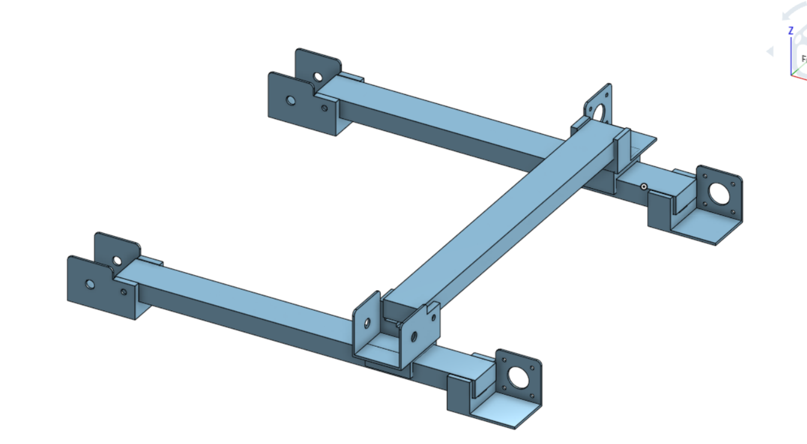

# Versatile X and Y Gantry

The Versatile X and Y Gantry is a modular, open-frame motion platform designed for robotics, automation, camera sliders, CNC experiments, pick-and-place systems, and other precision movement projects.

The design is highly customizable, allowing builders to modify the size of the frame, attach custom tools, and adapt it for many different applications.

## Features

- Modular design
- Lightweight and rigid frame
- 3D printable components
- NEMA 17 stepper motor compatible
- Belt-driven X and Y axes
- Expandable with custom end effectors
- Open-source hardware

---

### CAD Assembly

## Applications

- CNC
- Laser engraving
- Pen plotter
- Camera slider
- Pick and place
- Robotics research
- Vision systems

---

## Hardware

- Arduino Nano
- 2× NEMA 17 stepper motors
- GT2 timing belts
- GT2 pulleys
- LM8UU bearings
- 8 mm smooth rods
- M3 hardware

---

# Bill of Materials

| Item | Quantity | Notes |
|-------|---------:|------|
| Arduino Nano | 1 | Controller |
| NEMA 17 Stepper Motor | 2 | X and Y axes |
| A4988 or DRV8825 Driver | 2 | Stepper drivers |
| GT2 Timing Belt (6 mm) | 2 | Motion belts |
| GT2 20T Pulley | 2 | Motor pulleys |
| GT2 Idler Pulley | 4 | Belt routing |
| 8 mm Smooth Rod | 4 | Linear rails |
| LM8UU Linear Bearing | 8 | Motion bearings |
| M3 Screw Assortment | 1 kit | Assembly |
| M3 Nuts | 1 pack | Assembly |
| M3 Heat Set Inserts (optional) | As needed | Stronger threads |
| Power Supply (12 V) | 1 | Power |
| Wiring | As needed | Connections |

---

## Assembly

1. Print all 3D parts.
2. Install the smooth rods.
3. Insert the LM8UU bearings.
4. Mount the NEMA 17 motors.
5. Install the GT2 pulleys and belts.
6. Adjust belt tension.
7. Install electronics.
8. Upload the Arduino firmware.
9. Calibrate movement.
